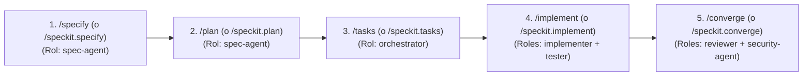

# 📐 Skill: Spec-Driven Development & Elite Agent v2 (GitHub Spec Kit Standard)

Esta habilidad dota al agente del estándar oficial **Spec-Driven Development (SDD)** de [github/spec-kit](https://github.com/github/spec-kit) y de la arquitectura de agentes gobernados de **elite-agent-bootstrap v2**. 

Su propósito es erradicar el "vibe coding" y estructurar el ciclo completo de diseño, implementación, verificación, traspasos de contexto y auditoría de agentes de IA con cero sobreingeniería.

---

## 🏛️ Puertas Constitucionales de Calidad (Hard Gates Innegociables)

1. **Lectura Constitucional Previa:** Antes de proponer o ejecutar cambios de arquitectura o código, el agente DEBE leer la constitución del proyecto en `.specify/memory/constitution.md`. Cualquier propuesta que viole un principio constitucional queda automáticamente invalidada.
2. **Separación Estricta de Autoridad (Agent ≠ Authority):** Ningún agente puede auto-aprobar su trabajo ni realizar merge directo a ramas de producción (`main`/`master`) sin revisión humana explícita. Los permisos y restricciones de rutas se consultan en `.agents/registry.json`.
3. **Cero Código sin Especificación Aprobada:** Prohibido crear, modificar o refactorizar archivos en el código fuente de producción sin contar con:
   - `specs/NNN-<nombre-feature>/spec.md` (Aprobado).
   - `specs/NNN-<nombre-feature>/plan.md` (Aprobado).
   - `specs/NNN-<nombre-feature>/tasks.md` (Con tareas atómicas y comandos de test).
4. **Evidencia antes de Afirmaciones:** No se marca ninguna tarea como completada (`[x]`) sin haber ejecutado el comando de verificación y comprobado que su resultado sea exitoso (`exit_code: 0`). Los comprobantes inmutables se registran en `.evidence/`.
5. **Protocolo de Traspasos Tipados:** Toda delegación de tareas entre agentes especializados debe formalizarse mediante un registro estructurado en `.agents/handoffs/` que preserve el contexto, las decisiones tomadas y los riesgos.

---

## 🔄 El Ciclo de Desarrollo SDD en 5 Fases



---

### Fase 1: `/specify (o /speckit.specify) <nombre-feature>` (spec-agent)
* **Objetivo:** Definir qué se va a construir y cuáles son sus criterios de aceptación (Given-When-Then), sin detalles de implementación.
* **Acciones:**
  1. Localizar el siguiente número correlativo en `specs/` (ej. `006-nuevo-modulo`).
  2. Crear el directorio `specs/NNN-<nombre-feature>/` usando la plantilla canónica `.specify/templates/spec.md`.
  3. Formular preguntas breves de aclaración (`/clarify (o /speckit.clarify)`) si existen ambigüedades.
  4. Presentar el `spec.md` y **DETENERSE**. Esperar la aprobación explícita del usuario.

---

### Fase 2: `/plan (o /speckit.plan)` (spec-agent / architect)
* **Objetivo:** Trazar el plano arquitectónico y técnico basándose en el `spec.md` aprobado.
* **Acciones:**
  1. Cargar el `spec.md` y `.specify/memory/constitution.md`.
  2. Determinar archivos exactos a crear, modificar o eliminar.
  3. Si la característica requiere decisiones rápidas, clasificación o scoring, definir el contrato con la capa de decisión (`lib/adapters/DecisionProvider.js` o Kev / `/v1/systemone`).
  4. Generar `specs/NNN-<nombre-feature>/plan.md`.
  5. Presentar el plan al usuario y solicitar su validación técnica.

---

### Fase 3: `/tasks (o /speckit.tasks)` (orchestrator / spec-agent)
* **Objetivo:** Descomponer el plan técnico en tareas de trabajo atómicas e independientes.
* **Acciones:**
  1. Generar `specs/NNN-<nombre-feature>/tasks.md` a partir de `.specify/templates/tasks.md`.
  2. Cada tarea debe tener:
     - Identificador unívoco: `[TASK-XXX]`.
     - Archivos afectados.
     - **Comando de verificación exacto** (ej. `npm test`, `pytest tests/`).
  3. Emitir el protocolo de traspaso inicial en `.agents/handoffs/` hacia `implementer`.
  4. El usuario aprueba la lista de tareas antes de iniciar la implementación.

---

### Fase 4: `/implement (o /speckit.implement)` (implementer + tester)
* **Objetivo:** Escribir el código siguiendo Test-Driven Development (TDD).
* **Acciones:**
  1. Tomar la siguiente tarea pendiente en `tasks.md`.
  2. Escribir la prueba unitaria o de integración (Fase RED).
  3. Ejecutar el test y comprobar que falla por la razón esperada.
  4. Implementar el código mínimo necesario para que el test pase (Fase GREEN).
  5. Refactorizar si es necesario (Fase REFACTOR).
  6. Registrar comprobante de ejecución en `.evidence/` con `exit_code: 0`.
  7. Marcar la tarea con `[x]` en `tasks.md` y realizar un commit atómico en Git (Conventional Commits en español).
  8. Repetir hasta completar todas las tareas.

---

### Fase 5: `/converge (o /speckit.converge)` (reviewer + security-agent)
* **Objetivo:** Validar la integridad final del sistema, auditar seguridad y cerrar la especificación.
* **Acciones:**
  1. Ejecutar la suite completa de pruebas y validaciones:
     - `gent verify` (100% de tareas).
     - `gent registry validate` (Gobernanza íntegra).
     - `gent handoff validate` (Traspasos válidos).
     - `gent evidence verify` (Comprobantes auditados).
     - `gent eval` (Evaluación sintética superada).
  2. Completar `specs/NNN-<nombre-feature>/checklist.md`.
  3. Registrar Architectural Decision Record (ADR) en `PROJECT_LOG.md`.
  4. Notificar al usuario para la revisión y aprobación humana final previa al merge.

---

## 🚀 Integración en Proyectos Nuevos y Existentes

Si te encuentras en un proyecto que aún no cuenta con la infraestructura de Spec-Kit:
- **Proyecto Existente (Brownfield)**: Ejecuta o recomienda ejecutar:
  ```bash
  npx --yes github:BeLc3bU/elite-agent-bootstrap init
  ```
  Aplica la política **Zero-Overwrite**: preserva `README.md` creando `SPECKIT_GUIDE.md` y actualiza reglas sin destruir archivos previos.
- **Proyecto Nuevo (Greenfield)**: Aplica las 4 preguntas de descubrimiento descritas en `AGENT_BOOTSTRAP.md` e inicializa la constitución y el registro de agentes `.agents/registry.json`.

---

## 🛠️ Comandos CLI Disponibles
| Comando | Descripción |
|---|---|
| `gent verify` | Valida el progreso de todas las specs activas |
| `gent registry validate` | Valida el catálogo formal de agentes contra JSON Schema |
| `gent registry list` | Lista los roles, permisos y niveles de riesgo de los agentes |
| `gent handoff validate` | Valida el protocolo formal de traspaso entre agentes |
| `gent handoff list` | Lista los traspasos históricos registrados |
| `gent evidence verify` | Audita que ninguna tarea completada carezca de comprobante exitoso |
| `gent evidence list` | Lista los comprobantes de ejecución inmutables |
| `gent route "<tarea>"` | Enruta la tarea al agente idóneo mediante la capa de decisión |
| `gent eval` | Ejecuta la batería de evaluación sintética de agentes (.evals/) |
| `gent create <nombre>` | Crea una nueva especificación numerada en `specs/` |
| `gent install-skill` | Instala o actualiza esta skill globalmente en Antigravity |
