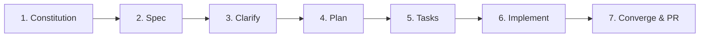

# 📜 Constitución del Proyecto

Este documento establece los principios de gobierno inmutables, estándares de calidad arquitectónica y reglas fundamentales para el desarrollo de este repositorio utilizando **Spec-Driven Development (SDD)**.

---

## 🏛️ 1. Principios Fundamentales

1. **Especificación Primero (Spec-First)**: Ninguna línea de código de producción debe ser escrita sin una especificación (`spec.md`), un plan técnico (`plan.md`) y una lista de tareas (`tasks.md`) aprobados.
2. **Idioma Oficial (100% Español)**:
   - Toda la documentación, especificaciones, planes y tareas se redactan en **Español**.
   - Los mensajes de commit (formato Conventional Commits), descripciones de Pull Request y notas de versión/changelogs DEBEN estar en **Español**.
   - El código fuente (nombres de variables, funciones, clases) sigue la convención estándar del stack en inglés técnico o en español según la convención del proyecto, pero comentarios y docs siempre en español.
3. **Simplicidad y Minimalismo (KISS & YAGNI)**: Diseñar para las necesidades actuales de la especificación sin sobre-ingeniería ni abstracciones prematuras.
4. **Desarrollo Guiado por Calidad (Quality Guardrails)**:
   - **Zero Errors Policy**: Prohibido abrir PRs o integrar código con fallos en `lint`, `typecheck` o pruebas unitarias.
   - **TDD / Verificación Continua**: Cada funcionalidad debe incluir pruebas automatizadas correspondientes.
   - **Evidencia Visual**: Si el cambio incluye UI/Frontend, es obligatorio incluir capturas de pantalla o validación visual.

---

## 🏗️ 2. Convenciones Técnicas y Arquitectura

- **Estructura Modular**: Separación estricta de responsabilidades (UI, Lógica de Negocio, Acceso a Datos, Integraciones).
- **Inmutabilidad de Decisiones**: Cualquier cambio arquitectónico de alto impacto debe registrarse en `PROJECT_LOG.md` y reflejarse en la especificación correspondiente.
- **Gestión de Versiones y Releases**:
   - Flujo de trabajo basado en ramas (`feature/XXX-nombre`, `fix/XXX-nombre`).
   - Integración con `release-please` para versionado semántico automático (`feat:`, `fix:`, `perf:`, `refactor:`, `docs:`).

---

## 🔄 3. Ciclo de Vida de una Funcionalidad (SDD Pipeline)

1. **`/speckit.specify`**: Redacción de la especificación funcional en `specs/XXX-feature/spec.md`.
2. **`/speckit.clarify`**: Resolución de ambigüedades, preguntas clave y validación de casos límite.
3. **`/speckit.plan`**: Diseño de la solución técnica, diagramas y dependencias en `specs/XXX-feature/plan.md`.
4. **`/speckit.tasks`**: Desglose de tareas granulares y ejecutables en `specs/XXX-feature/tasks.md`.
5. **`/speckit.implement`**: Ejecución secuencial de tareas con verificación continua.
6. **`/speckit.converge`**: Validación final de criterios de aceptación, suite de pruebas y creación de Pull Request.

---

## 🛡️ 4. Reglas de Modificación de la Constitución

- Esta constitución solo puede ser modificada por acuerdo explícito entre el usuario y el agente.
- Todo agente de IA debe validar su plan contra estos principios antes de proceder a la fase de implementación.
