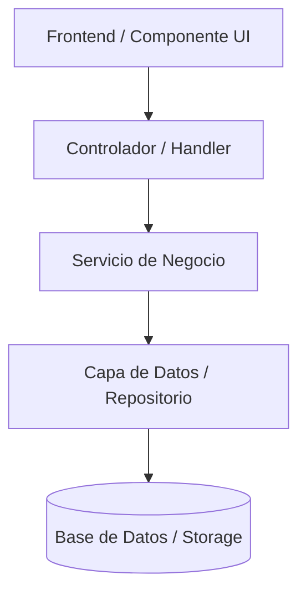

# 📐 Plan de Implementación Técnica: [NOMBRE_FEATURE]

**Feature Ref**: `[ID_FEATURE]` (enlace a `spec.md`)  
**Estado**: `[Propuesto | Aprobado | En Desarrollo | Completado]`  
**Arquitecto/Líder Técnico**: `[NOMBRE_DEL_ROL]`  
**Fecha de Aprobación**: `[YYYY-MM-DD]`

---

## 🏛️ 1. Arquitectura de la Solución

### Diagrama de Flujo / Componentes


### Descripción de Componentes
- **Componente 1**: `[Ruta / Archivo]` - [Propósito y responsabilidades]
- **Componente 2**: `[Ruta / Archivo]` - [Propósito y responsabilidades]
- **Componente 3**: `[Ruta / Archivo]` - [Propósito y responsabilidades]

---

## 📦 2. Modelos de Datos y Contratos (Schemas / Interfaces)

```typescript
// Ejemplo de interfaces o tipos TypeScript / Schemas Zod / Pydantic / Entidades
export interface [NombreModelo] {
  id: string;
  createdAt: Date;
  updatedAt: Date;
}
```

---

## 🌐 3. Endpoints de API / Contratos de Servicio (Si aplica)

| Método | Ruta | Parámetros / Body | Respuesta Exitosa | Errores Posibles |
|---|---|---|---|---|
| `POST` | `/api/v1/...` | `{ ... }` | `201 Created` | `400 Bad Request`, `409 Conflict` |
| `GET` | `/api/v1/...` | `?filtro=...` | `200 OK` | `404 Not Found` |

---

## 🛠️ 4. Estrategia de Testing (TDD & Guardrails)

1. **Pruebas Unitarias**:
   - `[Archivo de test]`: Validar funciones puras y lógica de negocio.
2. **Pruebas de Integración**:
   - `[Archivo de test]`: Validar interacción entre capas, endpoints y persistencia.
3. **Pruebas E2E / UI (Si aplica)**:
   - Validar flujos de usuario completos y capturar evidencias visuales.

---

## 🛡️ 5. Consideraciones de Seguridad y Rendimiento

- **Seguridad**: [Validación de entradas, control de acceso, prevención de inyecciones / XSS].
- **Rendimiento**: [Indexación de BD, paginación, lazy loading, gestión de memoria].

---

## 📋 6. Dependencias y Paquetes Nuevos
*Listar si se requieren nuevas librerías y justificación:*
- `[nombre-paquete@version]`: [Justificación técnica]
