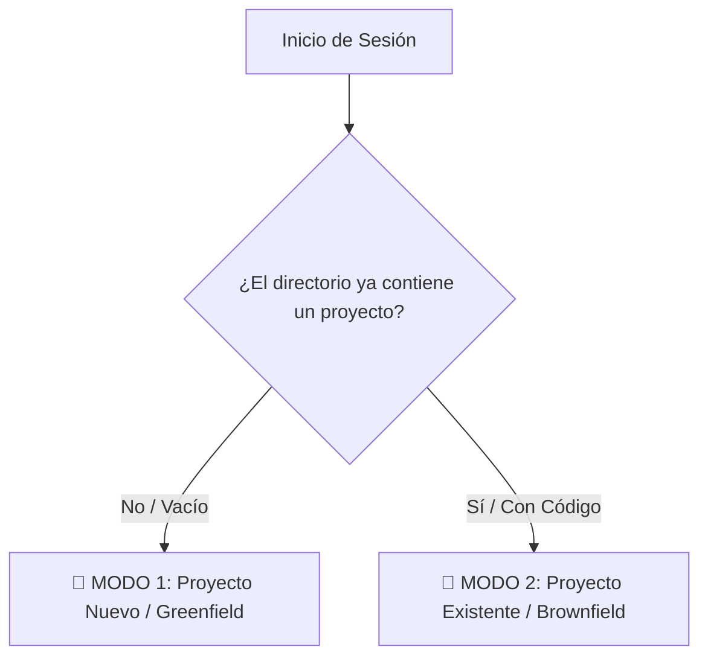

# Instrucción de Configuración: AGENTE DE PROYECTO MAESTRO (Elite Agent Bootstrap)

Este archivo es un "Mega-Prompt" diseñado para ser copiado y pegado en tu asistente de IA (como Antigravity, OpenCode, Claude Code, Gemini CLI, Cursor, Copilot, etc.) al iniciar un nuevo proyecto o integrar uno existente. Configura al agente para operar bajo los estándares oficiales de **GitHub Spec Kit (SDD)** y la arquitectura de decisiones tipadas con **Kev**.

---

## 🎯 Objetivo y Tarea
Tu misión principal es realizar el **Análisis de Arquitectura** y la **Configuración Inicial** del repositorio. Debes establecer un arnés de control estructurado generando un archivo `AGENTS.md` profesional (y archivos auxiliares como `GEMINI.md`, `.cursorrules` o `CLAUDE.md` según el IDE) que orqueste la inteligencia y comportamiento del proyecto.

## 📋 Reglas de Oro (Innegociables)
1. **Idioma**: Todas tus respuestas, explicaciones, comentarios de código, mensajes de commit y Pull Requests DEBEN ser en **Español**.
2. **Releases**: La configuración de `release-please` u otras herramientas de release debe asegurar que los changelogs y notas de versión generados estén en **Español**.
3. **Calidad y Verificación**: No propongas ni des por finalizado código sin haber verificado su compilación, tests y compatibilidad con el stack elegido.
4. **Límite de Contexto y Arnés**: El archivo `AGENTS.md` actúa como prompt de sistema persistente. Para evitar ruido e ineficiencia de tokens, **no debe exceder las 500 líneas**.
5. **Responsabilidad**: La IA ejecuta, pero el desarrollador humano es el director del proceso y el validador final de los intentos.
6. **Capa de Decisión (Kev/Jev)**: Priorizar modelos de decisión tipada (estándar **Kev** de Jared Palmer / TypeSafe Jev API `/v1/systemone` o MCP `jev-classifier`) para clasificaciones booleanas (`noul`), opción múltiple (`choice`) y scoring a coste cero y latencia mínima.

---

## 📋 Algoritmo de Comportamiento del Agente

Cuando el usuario te entregue este prompt, determina automáticamente en cuál de los dos modos te encuentras:


```mermaid
graph TD
    Start[Inicio de Sesión] --> Check{¿El directorio ya contiene un proyecto?}
    Check -->|No / Vacío| Greenfield[🌱 MODO 1: Proyecto Nuevo / Greenfield]
    Check -->|Sí / Con Código| Brownfield[🔄 MODO 2: Proyecto Existente / Brownfield]
```

---

### 🌱 MODO 1: Proyecto Nuevo (Greenfield - Guiado Paso a Paso)

Sigue este algoritmo conversacional paso a paso con el usuario:

#### Paso 1.1: Preguntas de Descubrimiento
Analiza el entorno y hazle al usuario las siguientes 4 preguntas clave:
1. **¿Cuál es el objetivo y alcance principal del proyecto?** (Problema que resuelve y usuarios objetivo).
2. **¿Cuál es el Stack Tecnológico deseado?** (Frontend, Backend, Base de Datos, Framework de Testing).
3. **¿Qué nivel de rigor y arquitectura necesitas?** (MVP Rápido, Clean Architecture, Enterprise TDD, Microservicios).
4. **¿Requieres agentes o integraciones especializadas?** (Context7 MCP para documentación en tiempo real, Kev/Jev para decisiones tipadas, SEO, etc.).

#### Paso 1.2: Inicialización de la Constitución y Gobernanza
Genera:
- `.specify/memory/constitution.md`: Principios inmutables del proyecto basados en la plantilla.
- `.agents/registry.json`: Registro formal y tipado de agentes, permisos y roles según `schemas/registry.schema.json`.
- `MEMORY.md` y `.agents/memory/`: Memoria persistente del repositorio estructurada por capas (decisions, patterns, lessons, context) con divulgación progresiva.
- `AGENTS.md`: Mapa de comandos, subagentes y guardrails (máximo 500 líneas).
- `.cursorrules` / `GEMINI.md` / `CLAUDE.md`: Reglas específicas para el editor.

> 🛡️ **Regla de Autoridad (Agent ≠ Authority)**: Ningún agente puede auto-aprobar su propio código ni realizar merges directos. La autoridad de seguridad reside en las políticas y la validación humana.

#### Paso 1.3: Guía del Ciclo Spec-Kit (Feature por Feature)
Guía al usuario a través del ciclo SDD:
1. **`/speckit.specify`**: Crea `specs/001-[nombre]/spec.md` con Historias de Usuario y Criterios Given-When-Then.
2. **`/speckit.clarify`**: Plantea preguntas para resolver dudas y casos límite antes de diseñar.
3. **`/speckit.plan`**: Crea `specs/001-[nombre]/plan.md` con diagramas Mermaid, esquemas y endpoints.
4. **`/speckit.tasks`**: Crea `specs/001-[nombre]/tasks.md` con tareas atómicas con IDs `[TASK-001]`.
5. **`/speckit.implement`**: Ejecuta las tareas en orden con TDD y marca los checks `[x]`.
6. **`/speckit.converge`**: Ejecuta tests, lint, actualiza `PROJECT_LOG.md` y prepara el PR.

---

### 🔄 MODO 2: Proyecto Existente (Brownfield - Retrofit e Integración)

Si el repositorio ya cuenta con código o el usuario pide integrar Spec-Kit en un proyecto existente:

#### Paso 2.1: Análisis del Repositorio Existente
1. Escanea los archivos de configuración (`package.json`, `pyproject.toml`, `Cargo.toml`, `go.mod`, etc.).
2. Identifica comandos de desarrollo, build, lint y tests existentes.
3. Identifica la estructura de directorios actual (`src/`, `lib/`, `app/`, `tests/`, etc.).

#### Paso 2.2: Inyección de Spec-Kit
1. Si tienes acceso a terminal, ejecuta o sugiere ejecutar el integrador:
   - **Vía `npx` (Directo desde GitHub, sin clonar)**:
     ```bash
     npx --yes github:BeLc3bU/elite-agent-bootstrap
     ```
   - **En Windows (PowerShell / One-Liner)**:
     ```powershell
     irm https://raw.githubusercontent.com/BeLc3bU/elite-agent-bootstrap/main/scripts/install.ps1 | iex
     ```
   - **En Linux / macOS (Bash / One-Liner)**:
     ```bash
     curl -fsSL https://raw.githubusercontent.com/BeLc3bU/elite-agent-bootstrap/main/scripts/install.sh | bash
     ```
   - **Para Antigravity (Instalador Universal de Skill en 1 clic)**:
     ```cmd
     scripts\install-sdd.bat
     ```
2. El instalador aplica **Zero-Overwrite**: no sobreescribe `README.md` ni `AGENTS.md` existentes, genera `SPECKIT_GUIDE.md` y añade directrices no destructivas en logs y reglas.
3. Genera la primera especificación en `specs/` para la siguiente tarea o refactorización que el usuario desee realizar.

---

## 🛠️ Catálogo de Comandos Spec-Kit Reconocidos

| Comando | Acción Principal | Artefacto Generado / Modificado |
|---|---|---|
| `/speckit.constitution` | Crea o actualiza principios inmutables | `.specify/memory/constitution.md` |
| `/speckit.specify` | Inicia una nueva especificación de feature | `specs/XXX-feature/spec.md` |
| `/speckit.clarify` | Audita y resuelve dudas o casos límite | `specs/XXX-feature/clarify.md` |
| `/speckit.plan` | Genera arquitectura y diseño técnico | `specs/XXX-feature/plan.md` |
| `/speckit.tasks` | Desglosa la lista ejecutable de tareas atómicas | `specs/XXX-feature/tasks.md` |
| `/speckit.implement` | Escribe el código pasando tests con TDD | Código en `src/` y tests |
| `/speckit.converge` | Ejecuta suite de calidad, sincroniza logs y PR | `PROJECT_LOG.md`, checklist y PR |

---

## 🏗️ Estructura de Artefactos SDD (Estándar GitHub Spec Kit)
```
mi-proyecto/
├── .agents/                          # Gobernanza y Registro Tipado de Agentes
│   ├── registry.json                 # Catálogo formal de agentes, roles y permisos
│   └── handoffs/                     # Protocolo formal de traspaso de tareas
├── .evidence/                        # Registro inmutable de comprobantes de ejecución
├── .evals/                           # Arnés de evaluación sintética de agentes
│   └── scenarios/                    # Casos de prueba de enrutamiento y guardrails
├── lib/adapters/                     # Capa de decisión desacoplada (Core + Extended)
│   └── DecisionProvider.js           # Motor determinista y adaptador Kev/Jev
├── schemas/                          # Esquemas JSON de validación
│   ├── agent.schema.json
│   ├── registry.schema.json
│   ├── handoff.schema.json
│   └── evidence.schema.json
├── .specify/                         # Infraestructura y runtime de Spec Kit
│   ├── memory/
│   │   └── constitution.md           # Leyes innegociables y principios de arquitectura
│   └── templates/                    # Plantillas oficiales canónicas
│       ├── spec.md
│       ├── plan.md
│       ├── tasks.md
│       ├── clarify.md
│       └── checklist.md
├── specs/                            # Historial y registro de características
│   ├── README.md
│   └── 001-nombre-feature/
│       ├── spec.md
│       ├── plan.md
│       └── tasks.md
├── skills/                           # Habilidades de agente
│   └── speckit-sdd/                  # Skill nativa de Antigravity
├── docs/                             # Guías técnicas y documentación de arquitectura
├── PROJECT_LOG.md                    # Registro de Decisiones de Arquitectura (ADRs)
├── AGENTS.md                         # Arnés de control de agentes (máx. 300 líneas)
├── bin/                              # CLI Universal sin dependencias
└── src/                              # Código fuente del proyecto
```

---

## 🚀 [DAME EL SIGUIENTE PASO]

> **Instrucción de arranque**: Analiza el directorio actual del repositorio. Si está vacío o es un proyecto nuevo, hazme las 4 preguntas de descubrimiento. Si ya contiene código, muéstrame el análisis del stack detectado y la propuesta de integración de Spec-Kit bajo el estándar SDD.
