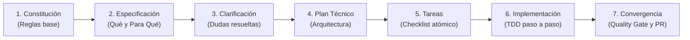

# 📖 Guía Definitiva de Uso: Elite Agent + Spec-Kit

Bienvenido a la guía práctica para desarrollar software con inteligencia artificial usando **Spec-Driven Development (SDD)**. Esta guía está diseñada para que cualquier desarrollador, líder técnico o entusiasta pueda usar el sistema de inmediato, tanto en proyectos desde cero como en proyectos existentes.

---

## 🧭 ¿Qué es esto y por qué usarlo?

Tradicionalmente, programar con IA (*vibe coding*) consiste en pedir código directamente en el chat, lo que suele generar:
- Alucinaciones y código desconectado de la arquitectura.
- Pérdida de contexto en proyectos medianos o grandes.
- Funcionalidades incompletas o sin pruebas.

**Spec-Driven Development (SDD)** resuelve esto convirtiendo el proceso en un flujo de **contratos estructurados en Markdown**:



---

## 🚀 Escenario A: Iniciar un Proyecto Nuevo (Greenfield)

Si vas a empezar un repositorio desde cero, el agente de IA actuará como tu arquitecto y líder técnico.

### Paso 1: Configurar el proyecto
1. Abre una carpeta vacía en tu editor favorito (Cursor, VSCode, Windsurf, Claude Code, etc.).
2. Abre el archivo [`AGENT_BOOTSTRAP.md`](AGENT_BOOTSTRAP.md) de esta plantilla, **copia todo su contenido** y pégalo en el chat de tu IA.

### Paso 2: Responder al Descubrimiento
El agente te formulará 4 preguntas clave:
1. **Objetivo del proyecto**: ¿Qué problema resuelve y para quién es?
2. **Stack tecnológico**: ¿Qué lenguaje, framework, base de datos y herramientas de test quieres usar?
3. **Nivel de rigor**: ¿Es un prototipo rápido, un MVP limpio o una aplicación Enterprise con TDD?
4. **Agentes especiales**: ¿Necesitas optimización de bundle, SEO, servidores MCP, etc.?

### Paso 3: Aprobación de la Constitución
El agente creará tu archivo `.specify/memory/constitution.md` y tu `AGENTS.md`. Léelos brevemente y dale tu aprobación.

### Paso 4: Construir tu primera funcionalidad
Escribe en el chat:
```text
/speckit.specify
```
o dile en lenguaje natural:
> *"Quiero crear la funcionalidad de registro y login de usuarios con ID 001."*

El agente creará la carpeta `specs/001-auth/` y te guiará por el ciclo completo:
- Redactará `spec.md` (Historias de usuario y criterios Given-When-Then).
- Te hará preguntas de clarificación en `clarify.md` si detecta casos límite.
- Diseñará la arquitectura técnica en `plan.md` (diagramas, endpoints, modelos).
- Desglosará las tareas en `tasks.md`.
- Con `/speckit.implement`, escribirá el código tarea por tarea con pruebas asociadas.
- Con `/speckit.converge`, verificará que lint y tests pasen al 100% y preparará el commit/PR.

---

## 🔄 Escenario B: Integrar en un Proyecto Existente (Brownfield)

Si ya tienes un repositorio con código funcionando y quieres añadirle esta metodología y reglas de agente sin alterar tus archivos originales:

### Método 1: Con `npx` Directo desde GitHub (Recomendado)

En la terminal de cualquier proyecto (o en una carpeta vacía para empezar uno nuevo):
```bash
# Ejecutar asistente interactivo directamente desde GitHub (sin clonar previamente)
npx --yes github:BeLc3bU/elite-agent-bootstrap

# O instalando la herramienta globalmente
npm install -g git+https://github.com/BeLc3bU/elite-agent-bootstrap.git
speckit
```

### Método 2: Con One-Liner (PowerShell / Bash)

#### En Windows (PowerShell):
```powershell
irm https://raw.githubusercontent.com/BeLc3bU/elite-agent-bootstrap/main/scripts/install.ps1 | iex
```

#### En Linux / macOS (Bash):
```bash
curl -fsSL https://raw.githubusercontent.com/BeLc3bU/elite-agent-bootstrap/main/scripts/install.sh | bash
```

### Método 3: Con los Scripts Locales (si ya tienes la plantilla clonada)

#### En Windows (PowerShell):
```powershell
powershell -ExecutionPolicy Bypass -File ".\scripts\integrate-speckit.ps1" -TargetDir "C:\Ruta\A\Tu\Proyecto"
```

#### En Linux / macOS (Bash):
```bash
./scripts/integrate-speckit.sh /ruta/a/tu/proyecto
```

> **🛡️ ¿Qué hace el instalador con garantía Zero-Overwrite?**
> 1. **Detección inteligente**: Detecta tu stack (Node.js/TS, Python, Rust, Go, etc.) y tus comandos de desarrollo, test y linting.
> 2. **Protección de `README.md`**: Si ya tienes un `README.md`, **no lo sobreescribe**. Genera un archivo complementario `SPECKIT_GUIDE.md` con la guía de comandos.
> 3. **Protección de `AGENTS.md`**: Si ya tienes un `AGENTS.md`, genera `AGENTS.speckit.md` (o realiza backup `.bak` si fuerzas la actualización) para que no pierdas configuraciones previas.
> 4. **Copia del motor**: Instala `.specify/`, `specs/` y `.github/prompts/` sin modificar el código fuente de tu aplicación.
> 5. **Append en logs y reglas**: Si ya tienes `PROJECT_LOG.md` o `.cursorrules`, añade las nuevas directrices al final sin borrar las existentes.

## 🎮 Catálogo de Comandos en el Chat

Puedes escribir estos comandos directamente en el chat de tu IA (Cursor, Copilot Chat, Claude Code, Gemini CLI, Antigravity):

| Comando | Cuándo usarlo | Qué hace el agente |
|---|---|---|
| `/speckit.constitution` | Al inicio del proyecto o al cambiar reglas | Define las políticas inmutables, estándares y guardrails en `.specify/memory/constitution.md`. |
| `/speckit.specify` | Al idear una nueva funcionalidad o cambio | Crea `specs/XXX-feature/spec.md` con historias de usuario y criterios de aceptación. |
| `/speckit.clarify` | Antes de escribir código o diseñar | Audita la especificación y te hace preguntas para resolver dudas y casos borde. |
| `/speckit.plan` | Cuando la especificación esté aprobada | Diseña la arquitectura, diagramas Mermaid, tipos de datos y endpoints en `plan.md`. |
| `/speckit.tasks` | Tras aprobar el plan técnico | Desglosa el plan en tareas atómicas y numeradas (`[TASK-001]`, `[TASK-002]`). |
| `/speckit.implement` | Para empezar a programar | Construye las tareas pendientes una a una aplicando TDD y marcando los checks en `tasks.md`. |
| `/speckit.converge` | Al terminar las tareas | Pasa la suite de tests, linter, actualiza `PROJECT_LOG.md` y redacta el Pull Request. |

---

## 🧰 Scripts Útiles en Terminal

Puedes ejecutar estos scripts desde la raíz de cualquier proyecto integrado:

### 1. Crear una nueva funcionalidad rápidamente:
- **Windows**:
  ```powershell
  .\.specify\scripts\create-feature.ps1 -FeatureId "002" -FeatureName "carrito-compras"
  ```
- **Linux/Mac**:
  ```bash
  ./.specify/scripts/create-feature.sh 002 carrito-compras
  ```
*Esto crea la carpeta `specs/002-carrito-compras/` con todas sus plantillas listas para rellenar.*

### 2. Comprobar el estado y avance de todas las features:
- **Windows**:
  ```powershell
  .\.specify\scripts\verify-spec.ps1
  ```
- **Linux/Mac**:
  ```bash
  ./.specify/scripts/verify-spec.sh
  ```
*Te mostrará una tabla visual con el porcentaje de tareas completadas por cada funcionalidad.*

---

## 🛡️ Las 4 Reglas de Oro (Para ti y para la IA)

1. **100% en Español**: Toda la documentación, mensajes de commit (Conventional Commits), PRs y chats deben ser en español.
2. **Spec-First**: Prohibido pedir o generar código sin su respectiva `spec.md`, `plan.md` y `tasks.md`.
3. **Zero Errors**: No se abren Pull Requests ni se integran ramas si fallan las pruebas unitarias, el linter o la compilación de tipos.
4. **Memoria Continua**: Cada decisión importante queda registrada en `PROJECT_LOG.md` para que el agente nunca olvide por qué se construyó algo de cierta manera.
