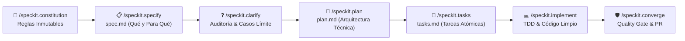

# 🚀 Elite Agent Bootstrap + GitHub Spec-Kit 📜

> **Plantilla Maestra y Toolkit de Desarrollo Guiado por Especificaciones (Spec-Driven Development / SDD)**  
> Integra la potencia de [GitHub Spec-Kit](https://github.com/github/spec-kit) con guardrails de calidad de élite, orquestación multi-agente, releases automáticas y soporte nativo 100% en Español.

---

## 🌟 ¿Qué es este Repositorio?

Este repositorio es una solución integral diseñada para eliminar el "vibe coding" y transformar el desarrollo asistido por IA en un proceso estructurado, predecible y de alta ingeniería.

👉 **¿Primera vez usando esta plantilla? Consulta la [Guía de Uso Paso a Paso (GUIA_DE_USO.md)](GUIA_DE_USO.md)**

Funciona en dos modalidades:
1. 🌱 **Proyecto Nuevo (Greenfield)**: El agente de IA te guía paso a paso desde el análisis de requisitos y constitución hasta la arquitectura, desglose de tareas e implementación con TDD.
2. 🔄 **Proyecto Existente (Brownfield)**: Con **un solo comando o script**, inyecta la arquitectura de Spec-Kit, detecta tu stack y configura las reglas del agente sin alterar el código existente.

---

## 🔄 El Flujo Spec-Driven Development (SDD Pipeline)



---

## 🛠️ Comandos Spec-Kit Disponibles

Una vez integrado en tu editor o asistente de IA (Cursor, Claude Code, GitHub Copilot, Gemini/Antigravity), puedes invocar estos comandos en el chat:

| Comando | Función | Artefacto Generado / Modificado |
|---|---|---|
| `/speckit.constitution` | Define las reglas inmutables y gobernanza del proyecto | `.specify/memory/constitution.md` |
| `/speckit.specify` | Crea la especificación funcional con historias de usuario y criterios Given-When-Then | `specs/[ID]-[NOMBRE]/spec.md` |
| `/speckit.clarify` | Plantea preguntas clave para resolver ambigüedades y casos límite | `specs/[ID]-[NOMBRE]/clarify.md` |
| `/speckit.plan` | Diseña la arquitectura técnica, diagramas Mermaid, esquemas y contratos | `specs/[ID]-[NOMBRE]/plan.md` |
| `/speckit.tasks` | Desglosa el plan en tareas granulares y ejecutables con IDs `[TASK-XXX]` | `specs/[ID]-[NOMBRE]/tasks.md` |
| `/speckit.implement` | Implementa secuencialmente cada tarea mediante TDD | Código en `src/` y tests |
| `/speckit.converge` | Ejecuta la suite de calidad (lint, test, typecheck), actualiza logs y prepara el PR | `PROJECT_LOG.md`, checklist y PR |

---

## 📦 Estructura del Repositorio

```text
├── .github/
│   ├── prompts/                    # Prompts integrados para Copilot Chat / VSCode
│   │   ├── speckit.constitution.prompt.md
│   │   ├── speckit.specify.prompt.md
│   │   ├── speckit.clarify.prompt.md
│   │   ├── speckit.plan.prompt.md
│   │   ├── speckit.tasks.prompt.md
│   │   ├── speckit.implement.prompt.md
│   │   └── speckit.converge.prompt.md
│   └── workflows/
│       ├── release-please.yml       # Release automatizada con changelogs en español
│       └── spec-quality-gate.yml    # Verificación CI/CD de tests, lint y specs
├── .specify/                       # Directorio de control de Spec-Kit
│   ├── memory/
│   │   └── constitution.md         # Principios inmutables del repositorio
│   ├── templates/                  # Plantillas oficiales en español
│   │   ├── spec-template.md
│   │   ├── plan-template.md
│   │   ├── tasks-template.md
│   │   ├── clarify-template.md
│   │   └── checklist-template.md
│   └── scripts/                    # Scripts de automatización local
│       ├── create-feature.ps1 / .sh
│       └── verify-spec.ps1 / .sh
├── scripts/
│   ├── integrate-speckit.ps1       # Script de integración para Windows
│   └── integrate-speckit.sh        # Script de integración para Linux / macOS
├── specs/                          # Directorio de especificaciones por feature
│   ├── README.md
│   └── 000-ejemplo-autenticacion/  # Ejemplo completo de referencia
├── .cursorrules                    # Reglas optimizadas para Cursor IDE
├── CLAUDE.md                       # Directrices optimizadas para Claude Code
├── AGENTS.md                       # Orquestación de agentes y guardrails del repo
├── AGENTS.template.md              # Plantilla dinámica para nuevos proyectos
├── AGENT_BOOTSTRAP.md              # Mega-Prompt maestro para la IA
├── PROJECT_LOG.md                  # Memoria técnica y Architectural Decision Records (ADRs)
└── README.md
```

---

## 📖 Guía de Uso

### Opción A: Iniciar un Proyecto Nuevo (Greenfield)

1. **Copia el contenido** de [`AGENT_BOOTSTRAP.md`](AGENT_BOOTSTRAP.md).
2. **Pégalo en tu asistente de IA** (Gemini, Claude, Antigravity, ChatGPT, Cursor).
3. **Responde a las 4 preguntas de descubrimiento** que te formulará el agente (Objetivo, Stack, Rigor, Agentes).
4. El agente creará tu `constitution.md`, `AGENTS.md` y te guiará para redactar tu primera especificación con `/speckit.specify`.

---

### Opción B: Integrar en un Proyecto Existente (Brownfield)

Puedes integrar Spec-Kit en cualquier repositorio existente de dos maneras:

#### 1. Mediante el Script de Integración (Recomendado)
Ejecuta el script apuntando a tu proyecto (o desde la raíz del mismo):

- **En Windows (PowerShell)**:
  ```powershell
  # Si ejecutas desde la plantilla apuntando a tu proyecto:
  .\scripts\integrate-speckit.ps1 -TargetDir "C:\Ruta\A\Tu\Proyecto"

  # O copia la carpeta scripts a tu proyecto y ejecuta:
  .\scripts\integrate-speckit.ps1
  ```

- **En Linux / macOS (Bash)**:
  ```bash
  ./scripts/integrate-speckit.sh /ruta/a/tu/proyecto
  ```

El script automáticamente:
- Crea la estructura `.specify/`, `specs/` y `.github/prompts/`.
- Detecta si usas Node.js, Python, Rust o Go y configura los comandos de test, lint y build en `AGENTS.md`.
- Inicializa `PROJECT_LOG.md` y `.cursorrules`.

#### 2. Mediante el CLI Oficial de Spec-Kit (`uvx` / `specify`)
Si tienes instalado [uv](https://astral.sh/uv/):
```bash
# Inicializar en el directorio actual
uvx --from git+https://github.com/github/spec-kit.git specify init --here

# O crear un proyecto nuevo
uvx --from git+https://github.com/github/spec-kit.git specify init mi-proyecto --ai copilot
```

---

## 🛡️ Guardrails de Calidad (Innegociables)

1. **Zero Errors Policy**: Prohibido abrir PRs si fallan tests, linter o compilación de tipos.
2. **Evidencia Visual**: Obligatorio adjuntar capturas de pantalla o grabaciones en PRs con cambios de UI.
3. **Releases en Español**: Integración con `release-please` para generar versiones semánticas y notas de release en español.
4. **Memoria de Decisiones**: Registro automático en `PROJECT_LOG.md` de decisiones arquitectónicas y progreso.

---

## 🤝 Scripts de Utilidad Rápida

| Acción | Comando PowerShell (Windows) | Comando Bash (Linux/macOS) |
|---|---|---|
| **Crear nueva spec** | `.\.specify\scripts\create-feature.ps1 -FeatureId "001" -FeatureName "mi-feature"` | `./.specify/scripts/create-feature.sh 001 mi-feature` |
| **Verificar estado de specs** | `.\.specify\scripts\verify-spec.ps1` | `./.specify/scripts/verify-spec.sh` |
| **Integrar en repo existente** | `.\scripts\integrate-speckit.ps1` | `./scripts/integrate-speckit.sh` |

---

## 📄 Licencia

Distribuido bajo licencia MIT. ¡Úsalo libremente para potenciar tus proyectos con IA de alto rendimiento!
