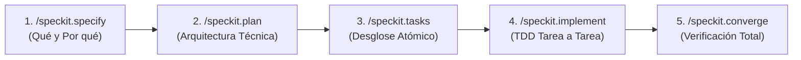

# 📐 Skill: Spec-Driven Development (GitHub Spec Kit)

Esta habilidad dota al agente de la metodología oficial **Spec-Driven Development (SDD)** de [github/spec-kit](https://github.com/github/spec-kit). Su propósito es convertir requerimientos informales en software riguroso, probado y alineado con la arquitectura del proyecto, evitando el "vibe coding" o desarrollo sin rumbo.

---

## 🏛️ Puertas de Enlace Obligatorias (Hard Gates)

1. **Lectura Constitucional Previa:** Antes de proponer o ejecutar cualquier cambio, el agente DEBE leer la constitución del proyecto en `.specify/memory/constitution.md` (o archivo equivalente). Cualquier propuesta que viole un principio constitucional queda inmediatamente invalidada.
2. **Cero Código sin Especificación:** Está terminantemente prohibido crear, modificar o refactorizar archivos en el código fuente de producción (`src/`, `app/`, etc.) sin contar con:
   - `specs/NNN-<nombre-feature>/spec.md` (Aprobado).
   - `specs/NNN-<nombre-feature>/plan.md` (Aprobado).
   - `specs/NNN-<nombre-feature>/tasks.md` (Con tareas atómicas y comandos de test).
3. **Evidencia antes de Afirmaciones:** No se marca ninguna tarea como completada (`[x]`) sin haber ejecutado el comando de verificación y comprobado que su resultado sea exitoso (GREEN).

---

## 🔄 El Ciclo de Desarrollo en 5 Fases

---

### Fase 1: `/speckit.specify <nombre-feature>`
* **Objetivo:** Definir con total claridad qué se va a construir y cuáles son sus criterios de aceptación, sin entrar en detalles de implementación.
* **Acciones del Agente:**
  1. Localizar el siguiente número correlativo en `specs/` (ej. `002-gestion-usuarios`).
  2. Crear el directorio `specs/NNN-<nombre-feature>/`.
  3. Tomar la plantilla de `.specify/templates/spec.md` y redactar el borrador inicial.
  4. Formular preguntas breves de aclaración al usuario si existen requisitos ambiguos.
  5. Presentar el `spec.md` y **DETENERSE**. Esperar la aprobación explícita del usuario.

---

### Fase 2: `/speckit.plan`
* **Objetivo:** Trazar el plano arquitectónico y técnico de la solución basándose en el `spec.md` aprobado.
* **Acciones del Agente:**
  1. Cargar el `spec.md` y la `constitution.md`.
  2. Determinar los archivos exactos a crear, modificar o eliminar.
  3. Si la característica requiere decisiones rápidas, clasificación de texto, enrutamiento o scoring, definir el contrato tipado con **Kev** (`jaredpalmer/kev` / `/v1/systemone` / `jev-classifier`).
  4. Generar `specs/NNN-<nombre-feature>/plan.md`.
  5. Presentar el plan al usuario y solicitar su validación técnica.

---

### Fase 3: `/speckit.tasks`
* **Objetivo:** Descomponer el plan técnico en tareas de trabajo atómicas e independientes.
* **Acciones del Agente:**
  1. Generar `specs/NNN-<nombre-feature>/tasks.md`.
  2. Cada tarea debe tener:
     - Componente y archivos afectados.
     - Breve descripción del cambio.
     - **Comando de verificación exacto** (ej. `pytest tests/test_login.py -v`).
  3. El usuario aprueba la lista de tareas antes de iniciar la implementación.

---

### Fase 4: `/speckit.implement`
* **Objetivo:** Escribir el código siguiendo la metodología Test-Driven Development (TDD).
* **Acciones del Agente:**
  1. Tomar la siguiente tarea pendiente en `tasks.md`.
  2. Escribir la prueba unitaria o de integración (Fase RED).
  3. Ejecutar el test y comprobar que falla por la razón esperada.
  4. Implementar el código mínimo necesario para que el test pase (Fase GREEN).
  5. Ejecutar la prueba y comprobar que pase.
  6. Marcar la tarea con `[x]` en `tasks.md` y realizar un commit atómico en Git.
  7. Repetir hasta completar todas las tareas.

---

### Fase 5: `/speckit.converge`
* **Objetivo:** Validar la integridad final del sistema y cerrar la especificación.
* **Acciones del Agente:**
  1. Ejecutar la suite completa de pruebas del proyecto (`pytest`, `npm test`, `cargo test`, etc.).
  2. Ejecutar linters y herramientas de análisis estático.
  3. Validar punto por punto los criterios de aceptación del `spec.md`.
  4. Cambiar el estado de la especificación a `IMPLEMENTED`.
  5. Actualizar la documentación y registrar el commit de cierre.
