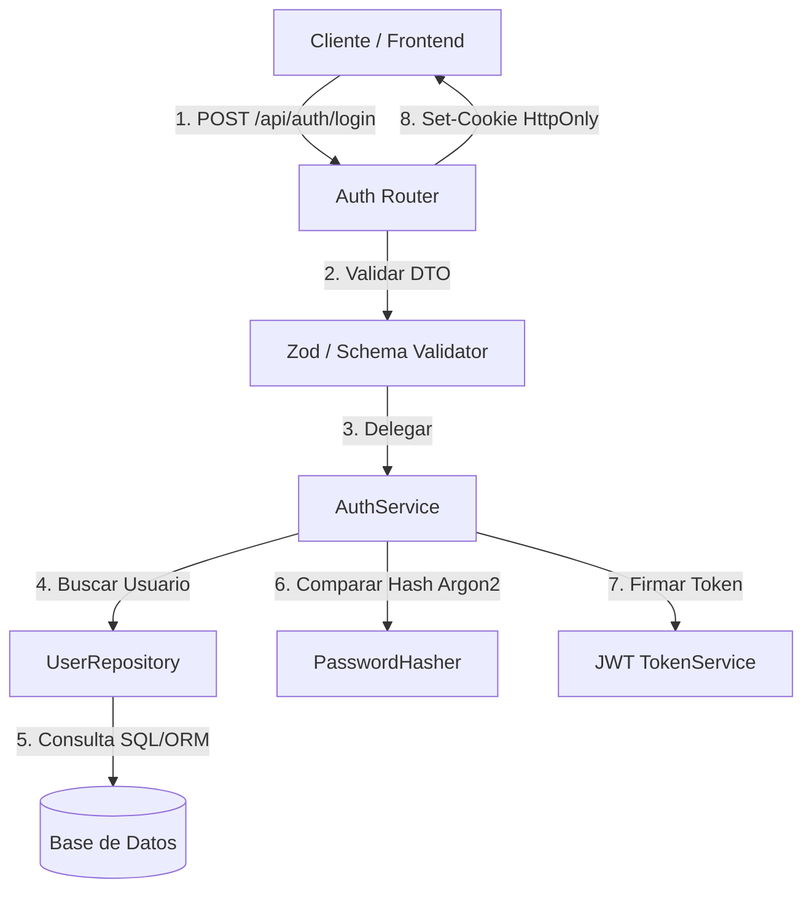

# 📐 Plan de Implementación Técnica: Autenticación de Usuarios con JWT

**Feature Ref**: `000-ejemplo-autenticacion` (enlace a [spec.md](spec.md))  
**Estado**: `Completado (Ejemplo de Referencia)`  
**Arquitecto/Líder Técnico**: `LeadArchitectAgent`  
**Fecha de Aprobación**: `2026-08-16`

---

## 🏛️ 1. Arquitectura de la Solución



---

## 📦 2. Modelos de Datos y Contratos (Schemas)

```typescript
export interface LoginRequestDto {
  email: string; // Formato email válido
  password: string; // Mínimo 8 caracteres
}

export interface UserSessionPayload {
  userId: string;
  email: string;
  role: 'admin' | 'user';
  iat: number;
  exp: number;
}
```

---

## 🌐 3. Endpoints de API

| Método | Ruta | Parámetros / Body | Respuesta Exitosa | Errores Posibles |
|---|---|---|---|---|
| `POST` | `/api/auth/login` | `{ email, password }` | `200 OK` (Set-Cookie) | `400 Validation`, `401 Bad Credentials`, `429 Rate Limited` |
| `POST` | `/api/auth/logout` | Ninguno | `200 OK` (Clear-Cookie) | `401 Unauthorized` |
| `GET` | `/api/auth/me` | Header Cookie | `200 OK` `{ user }` | `401 Unauthorized` |

---

## 🛠️ 4. Estrategia de Testing

1. **Unit Tests**:
   - Validación de hashing de contraseñas con Argon2.
   - Generación y verificación de firma de JWT.
2. **Integration Tests**:
   - Endpoint `/api/auth/login` con credenciales válidas e inválidas.
   - Verificación de la cookie `HttpOnly` y flag `SameSite=Strict`.
