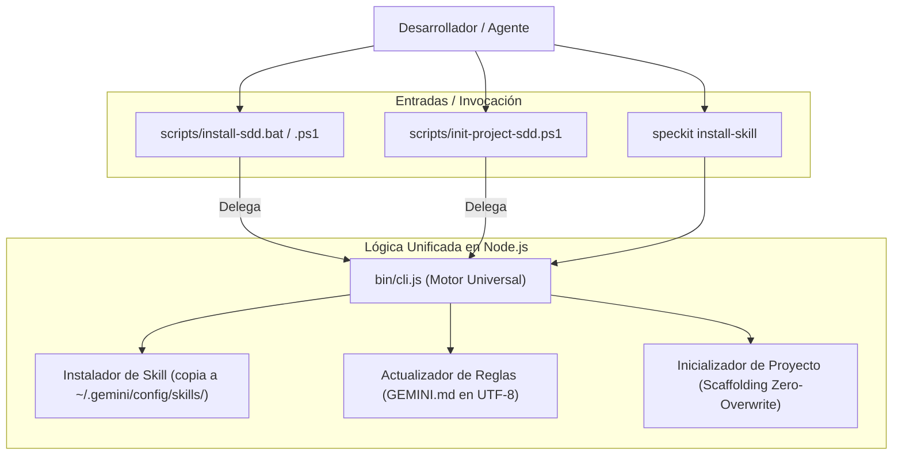

# 📐 Plan de Arquitectura Técnica: Fase 1 - Consolidación del CLI y Limpieza de Legado

**Identificador**: `002-v2-phase1-consolidation`  
**Estado**: `Aprobado`  
**Fecha de Creación**: `2026-09-28`  
**Última Actualización**: `2026-09-28`  
**Especificación de Referencia**: `specs/002-v2-phase1-consolidation/spec.md`

---

## 🏛️ 1. Decisiones de Diseño y Arquitectura

1. **CLI como Núcleo de Ejecución (Single Source of Truth):**
   * Toda la lógica de negocio (detección de contexto, copia de carpetas, instalación de skills, validación de specs y creación de features) reside exclusivamente en `bin/cli.js`.
   * Los scripts shell (`.sh`, `.ps1`, `.bat`) se reducen a wrappers que comprueban que `node` está disponible y delegan la ejecución en `bin/cli.js`.

2. **Cero Dependencias de Producción (Zero Dependencies):**
   * El CLI utiliza únicamente módulos estándar de Node.js (`fs`, `path`, `os`, `readline`, `child_process`).
   * No se agregan paquetes npm como `commander`, `chalk` o `yargs`. La implementación nativa actual es ligera, rápida y tiene cero superficie de vulnerabilidades de supply chain.

3. **Canonicidad de Plantillas:**
   * En `.specify/templates/`, eliminamos la redundancia de tener `spec.md` y `spec-template.md` coexistiendo. Se mantienen únicamente los archivos estándar:
     - `spec.md`
     - `plan.md`
     - `tasks.md`
     - `clarify.md`
     - `checklist-template.md`
   * El CLI leerá directamente de estos archivos canónicos.

---

## 📁 2. Componentes y Archivos Afectados

```text
bin/
└── cli.js                          # [MODIFICAR] Agregar comando 'install-skill' y soporte CLI unificado
.specify/templates/
├── spec-template.md                # [ELIMINAR] Duplicado de spec.md
├── plan-template.md                # [ELIMINAR] Duplicado de plan.md
└── tasks-template.md               # [ELIMINAR] Duplicado de tasks.md
scripts/
├── install-sdd.bat                 # [MODIFICAR] Convertir en wrapper a 'node bin/cli.js install-skill'
├── install-sdd.ps1                 # [MODIFICAR] Convertir en wrapper a 'node bin/cli.js install-skill'
├── init-project-sdd.bat            # [MODIFICAR] Convertir en wrapper a 'node bin/cli.js init'
├── init-project-sdd.ps1            # [MODIFICAR] Convertir en wrapper a 'node bin/cli.js init'
├── install.bat                     # [NUEVO/AJUSTAR] Wrapper simple
├── install.ps1                     # [MODIFICAR] Delegar en node bin/cli.js
└── install.sh                      # [MODIFICAR] Delegar en node bin/cli.js
docs/
└── kev-decision-guide.md           # [MODIFICAR] Limpiar rutas Windows locales y universalizar
specs/002-v2-phase1-consolidation/
├── spec.md                         # [CREADO]
├── plan.md                         # [CREADO]
└── tasks.md                        # [CREADO]
```

---

## 🔄 3. Diagrama de Flujo de la Solución



---

## 🛡️ 4. Verificación y Pruebas
1. Ejecución de `node bin/cli.js install-skill` en terminal local y verificación de salida verde.
2. Comprobación de que la skill en `~/.gemini/config/skills/speckit-sdd/SKILL.md` coincide y `GEMINI.md` no se duplica.
3. Ejecución de `node bin/cli.js verify` para asegurar que el validador de specs reconoce todas las carpetas.
4. Ejecución de `npm run test:verify` y confirmación de exit code 0.
