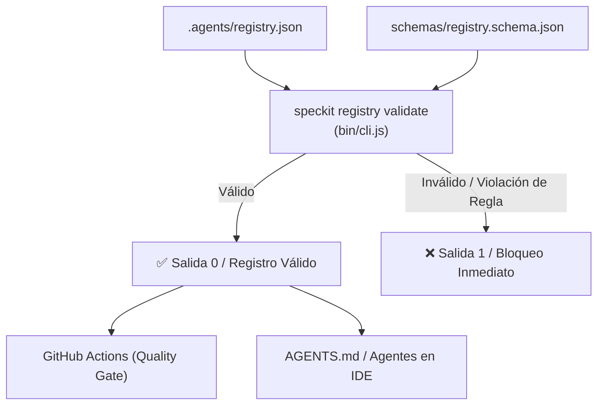

# 📐 Plan de Arquitectura Técnica: Fase 2 - Gobernanza y Registro Tipado de Agentes

**Identificador**: `003-v2-phase2-agent-registry`  
**Estado**: `Aprobado`  
**Fecha de Creación**: `2026-09-28`  
**Última Actualización**: `2026-09-28`  
**Especificación de Referencia**: `specs/003-v2-phase2-agent-registry/spec.md`

---

## 🏛️ 1. Decisiones de Diseño y Arquitectura

1. **Definición Formal de Esquemas (JSON Schema Draft-07):**
   * Se crean dos esquemas en `schemas/`:
     - `schemas/agent.schema.json`: Esquema para cada agente individual.
     - `schemas/registry.schema.json`: Esquema para el registro contenedor `.agents/registry.json`.
   * Los esquemas son utilizables por cualquier herramienta de validación, IDE (con autocompletado en VSCode/Cursor) y el CLI `speckit`.

2. **Validador Nativo Ligero (Zero-Dependencies JSON Schema Validator):**
   * Para respetar la **Regla Anti-Sobreingeniería** y mantener el paquete sin dependencias externas (cero `npm install`), implementaremos un validador estructural en `bin/cli.js` que verifica tipos (`type`), campos requeridos (`required`), enumeraciones (`enum`) y coherencia de permisos de seguridad.

3. **Matriz de Separación de Autoridad (Authority Matrix):**

| Rol / Agente | Riesgo | `can_modify_code` | `can_modify_specs` | `can_modify_governance` | `can_merge` | `requires_human_approval` |
|---|---|---|---|---|---|---|
| **Orchestrator** | `medium` | `false` | `true` | `false` | `false` | `false` |
| **SpecAgent** | `low` | `false` | `true` | `false` | `false` | `false` |
| **Implementer** | `medium` | `true` | `false` | `false` | `false` | `false` |
| **TestingAgent** | `low` | `true` (solo tests) | `false` | `false` | `false` | `false` |
| **SecurityAgent**| `low` | `false` | `false` | `false` | `false` | `false` |
| **ReviewerAgent**| `medium` | `false` | `false` | `false` | `false` | `true` (para merge) |
| **OptimizationAgent**| `low` | `false` | `false` | `false` | `false` | `false` |

---

## 📁 2. Componentes y Archivos Afectados

```text
schemas/
├── agent.schema.json               # [NUEVO] Esquema atómico de agente
└── registry.schema.json            # [NUEVO] Esquema del registro de agentes
.agents/
└── registry.json                   # [NUEVO] Registro formal de agentes del proyecto
bin/
└── cli.js                          # [MODIFICAR] Añadir subcomandos 'registry list' y 'registry validate'
AGENTS.md                           # [MODIFICAR] Sincronizar tabla de agentes con el registro formal
AGENT_BOOTSTRAP.md                  # [MODIFICAR] Actualizar directrices para leer .agents/registry.json
specs/003-v2-phase2-agent-registry/
├── spec.md                         # [CREADO]
├── plan.md                         # [CREADO]
└── tasks.md                        # [CREADO]
```

---

## 🔄 3. Diagrama de Verificación y Flujo de Gobernanza



---

## 🛡️ 4. Verificación y Pruebas
1. Validación manual y automatizada de `.agents/registry.json` contra `schemas/registry.schema.json`.
2. Prueba de fallo: Introducir un agente inválido temporalmente y verificar que `node bin/cli.js registry validate` devuelve código 1 y detecta el error.
3. Ejecución de `node bin/cli.js registry list` y confirmación de que lista los 7 agentes con sus banderas y riesgos en terminal con formato de tabla legible.
4. Ejecución de `npm run test:verify` y confirmación de que todas las specs siguen al 100%.
