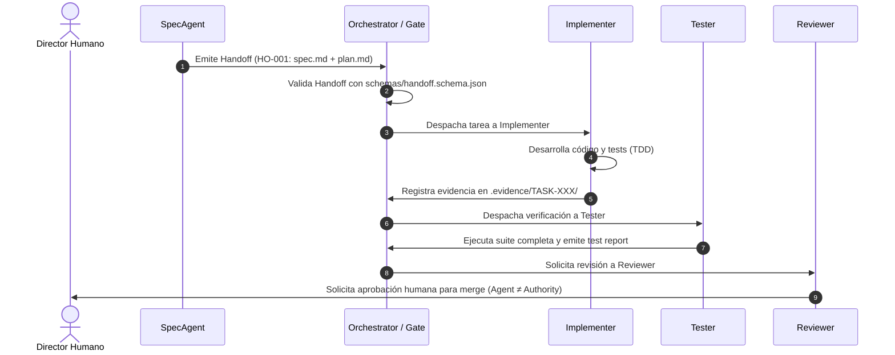

# 📐 Plan de Arquitectura Técnica: Fase 3 - Puertas de Evidencia, Protocolo de Handoffs y CI/CD Gates

**Identificador**: `004-v2-phase3-handoffs-evidence`  
**Estado**: `Aprobado`  
**Fecha de Creación**: `2026-09-28`  
**Última Actualización**: `2026-09-28`  
**Especificación de Referencia**: `specs/004-v2-phase3-handoffs-evidence/spec.md`

---

## 🏛️ 1. Decisiones de Diseño y Arquitectura

1. **Protocolo de Handoff Basado en Archivos (Git-Native Handoffs):**
   * En lugar de incurrir en la sobreingeniería de un broker de mensajería (Kafka, RabbitMQ) o protocolos A2A por sockets HTTP, cada traspaso entre agentes se almacena como un archivo JSON inmutable en `.agents/handoffs/HANDOFF-[ID].json`.
   * Esto proporciona auditoría natural con `git log`, revisión en Pull Requests y recuperación de estado sin servidores auxiliares.

2. **Esquema de Handoff (`schemas/handoff.schema.json`):**
   * Valida:
     - `handoff_id`: Identificador único (ej. `HO-001-spec-to-implementer`).
     - `from`: ID del agente emisor (debe existir en `.agents/registry.json`).
     - `to`: ID del agente receptor (debe existir en `.agents/registry.json`).
     - `task_id`: Identificador de la tarea (ej. `TASK-001`).
     - `objective`: Propósito del traspaso.
     - `context`: Resumen de estado actual.
     - `inputs`: Lista de insumos.
     - `constraints`: Restricciones arquitectónicas o de seguridad.
     - `completed`: Lista de items completados.
     - `decisions`: Decisiones tomadas por el agente emisor.
     - `artifacts`: Archivos generados que se entregan al receptor.
     - `evidence`: Referencias a logs o comprobantes.
     - `unresolved`: Preguntas abiertas o bloqueos.
     - `risks`: Riesgos identificados.
     - `next_action`: Acción inmediata requerida por el receptor.
     - `required_approval`: Booleano (indica si requiere firma humana).
     - `timestamp`: Fecha y hora ISO-8601.

3. **Arquitectura del Sistema de Evidencias (`.evidence/`):**
   * Estructura por feature y tarea:
     ```text
     .evidence/
     ├── README.md                          # Guía del sistema de evidencias
     └── 004-v2-phase3-handoffs-evidence/
         └── TASK-001/
             ├── execution.json             # Comprobante estructurado
             └── test-output.txt            # Salida cruda de la terminal
     ```
   * `schemas/evidence.schema.json` valida `execution.json`:
     - `task_id`, `feature_id`, `runner_agent`, `command`, `exit_code`, `status`, `timestamp`.

---

## 📁 2. Componentes y Archivos Afectados

```text
schemas/
├── handoff.schema.json             # [NUEVO] Esquema formal de traspasos
└── evidence.schema.json            # [NUEVO] Esquema de comprobantes de evidencia
.agents/
└── handoffs/
    ├── README.md                   # [NUEVO] Directrices de handoffs
    └── HO-001-baseline.json        # [NUEVO] Handoff canónico de referencia
.evidence/
    └── README.md                   # [NUEVO] Directrices del sistema de evidencias
bin/
└── cli.js                          # [MODIFICAR] Añadir subcomandos 'handoff' y 'evidence'
.github/workflows/
└── spec-quality-gate.yml           # [MODIFICAR] Añadir validación de handoffs y evidencias en CI
specs/004-v2-phase3-handoffs-evidence/
├── spec.md                         # [CREADO]
├── plan.md                         # [CREADO]
└── tasks.md                        # [CREADO]
```

---

## 🔄 3. Diagrama de Transición de Handoff y Puerta de Evidencia



---

## 🛡️ 4. Verificación y Pruebas
1. Validar que `schemas/handoff.schema.json` y `schemas/evidence.schema.json` sean sintácticamente correctos.
2. Comprobar que `node bin/cli.js handoff validate` valida los handoffs registrados en `.agents/handoffs/`.
3. Comprobar que `node bin/cli.js evidence verify` verifica la integridad de los comprobantes.
4. Ejecutar `npm run test:verify` y asegurar que todas las especificaciones siguen al 100%.
