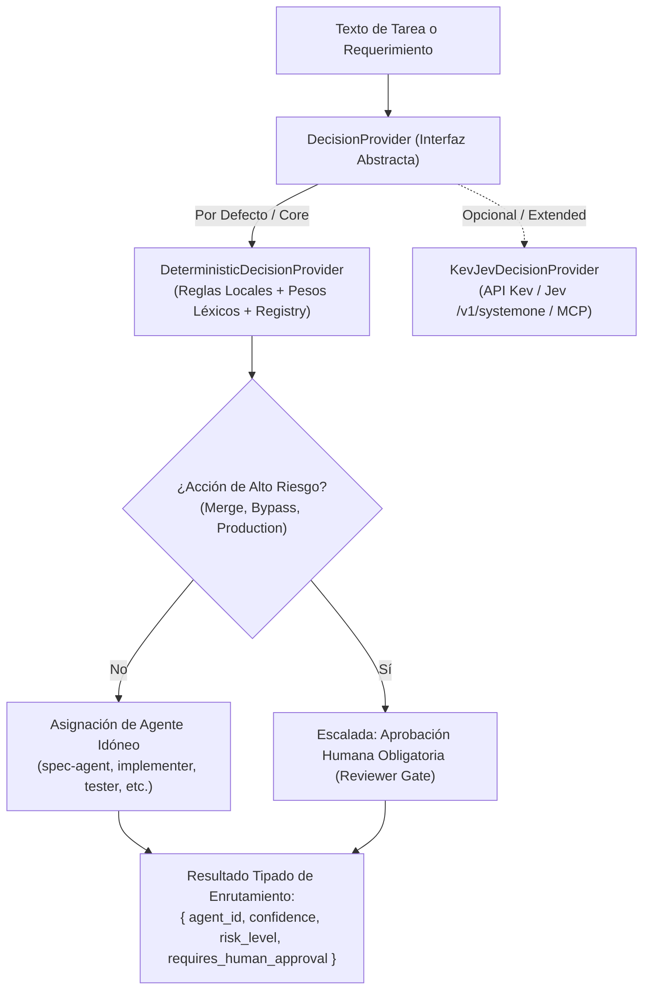

# 📐 Plan Técnico de Arquitectura: Fase 4 - Capa de Decisión y Adaptadores

**Identificador**: `005-v2-phase4-decision-adapters`  
**Estado**: `Aprobado`  
**Fecha de Creación**: `2026-09-28`  
**Última Actualización**: `2026-09-28`  
**Autor/Agente**: `Principal AI Architect`

---

## 🏛️ 1. Arquitectura del Módulo de Decisión

---

## 📂 2. Especificación de Archivos a Crear y Modificar

### Archivos Nuevos:
1. `lib/adapters/DecisionProvider.js`:
   - Implementa `DecisionProvider` (interfaz base).
   - Implementa `DeterministicDecisionProvider` (núcleo sin dependencias, basado en reglas y registro).
   - Implementa `KevJevDecisionProvider` (adaptador extensible con fallback automático).
2. `.evals/README.md`: Documentación y estándares del arnés de evaluación sintética.
3. `.evals/scenarios/routing-scenarios.json`: Conjunto de casos de prueba con inputs, salida esperada (`expected_agent`), criticidad y requerimiento de aprobación humana.
4. `.evidence/EV-002-evals-routing.json`: Comprobante de verificación de la suite de evaluación.

### Archivos a Modificar:
1. `bin/cli.js`:
   - Añadir soporte para `speckit route <tarea>` y `speckit eval`.
2. `package.json`:
   - Añadir script `"test:evals": "node bin/cli.js eval"`.
   - Añadir `.evals` y `lib` a la lista `"files"`.
3. `.github/workflows/spec-quality-gate.yml`:
   - Añadir paso bloqueante `Ejecutar Evaluación Sintética de Enrutamiento` (`node bin/cli.js eval`).
4. `PROJECT_LOG.md`:
   - Registrar **ADR-007: Capa de Decisión Desacoplada y Arnés de Evaluación Sintética**.

---

## 🛡️ 3. Principio Core vs. Extended
- **Core**: Todo el sistema debe ser 100% operativo sin dependencias externas en `package.json` y sin llamadas de red obligatorias. `DeterministicDecisionProvider` garantiza latencia < 5ms y compatibilidad universal en local y CI.
- **Extended**: Los equipos que utilicen Kev/Jev o microservicios de decisión pueden configurar las variables de entorno correspondientes para activar `KevJevDecisionProvider` sin alterar el código de gobernanza ni los flujos SDD.
