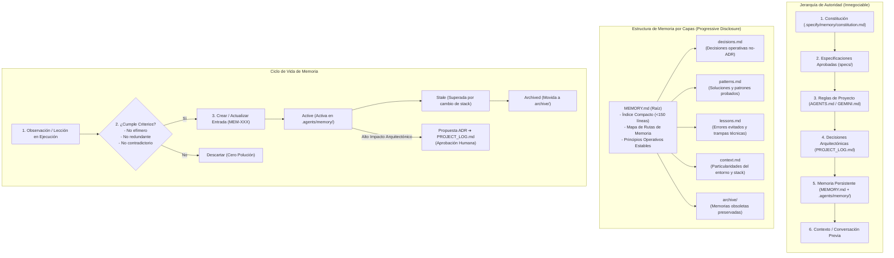

# 📐 Plan Técnico de Arquitectura: Sistema de Memoria Persistente de Agentes

**Identificador**: `006-persistent-agent-memory`  
**Estado**: `Aprobado`  
**Fecha**: `2026-10-01`  
**Autor/Agente**: `Principal AI Architect`

---

## 🏛️ 1. Arquitectura del Sistema de Memoria

---

## 📂 2. Especificación de Archivos a Crear y Modificar

### Archivos Nuevos:
1. `MEMORY.md`:
   - Archivo canónico en raíz con el índice general, principios operacionales y resúmenes de alto valor.
2. `.agents/memory/`:
   - `.agents/memory/decisions.md`: Decisiones operativas y convenciones menores.
   - `.agents/memory/patterns.md`: Patrones de diseño e implementación validados.
   - `.agents/memory/lessons.md`: Errores, fallos y lecciones aprendidas con soluciones.
   - `.agents/memory/context.md`: Contexto operacional estable y particularidades técnicas.
   - `.agents/memory/archive/README.md`: Directorio de archivo para memorias retiradas o deprecadas.
3. `.agents/rules/memory-protocol.md`:
   - Regla Antigravity y protocolo formal de ciclo de vida de memoria (lectura progresiva, evaluación y persistencia).
4. `schemas/memory.schema.json`:
   - Esquema JSON Schema Draft-07 para validar el catálogo e items individuales de memoria (`MEM-XXX-*`).
5. `.evidence/EV-003-memory-system.json`:
   - Comprobante inmutable de la verificación y validación del sistema de memoria.

### Archivos a Modificar:
1. `schemas/agent.schema.json`:
   - Añadir soporte para permisos de memoria en las definiciones de agentes si aplica o validar compatibilidad.
2. `.agents/registry.json`:
   - Añadir capacidades `memory-read`, `memory-write`, `memory-maintenance` en los roles pertinentes respetando `Agent ≠ Authority`.
3. `bin/cli.js`:
   - Implementar el comando `speckit memory` con subacciones:
     - `speckit memory list` (o `ls`)
     - `speckit memory validate`
     - `speckit memory search <query>`
     - `speckit memory show <id>`
     - `speckit memory add`
     - `speckit memory archive <id>`
4. `package.json`:
   - Añadir script `"test:memory": "node bin/cli.js memory validate"`.
   - Incluir `MEMORY.md` y `.agents/memory` en el array `"files"`.
5. `.github/workflows/spec-quality-gate.yml`:
   - Agregar paso de validación `node bin/cli.js memory validate`.
6. `AGENTS.md` y `GEMINI.md`:
   - Incorporar referencias concisas al protocolo de memoria persistente respetando el principio de divulgación progresiva.
7. `CLAUDE.md`:
   - Añadir mención a la disponibilidad de `MEMORY.md` y `speckit memory`.
8. `README.md` y `AGENT_BOOTSTRAP.md`:
   - Documentar la arquitectura de memoria persistente, jerarquía y comandos.
9. `PROJECT_LOG.md`:
   - Documentar **ADR-008: Sistema Nativo de Memoria Persistente de Agentes**.

---

## 🛡️ 3. Criterios de Selección y Deduplicación de Memoria

Una entrada sólo debe persistirse si cumple **al menos uno** de los siguientes criterios:
1. Evita repetir una investigación costosa de librerías, tooling o configuración.
2. Evita repetir un error o trampa técnica ya depurada.
3. Captura un patrón de código o pruebas recurrente en el repositorio.
4. Documenta una integración no trivial o convención de entorno (ej. Windows PowerShell vs Bash).
5. Permite a un agente posterior entender una decisión previa sin leer cientos de mensajes de chat.

**PROHIBIDO PERSISTIR:**
- Estados transitorios o temporales (para eso están los handoffs).
- Resúmenes conversacionales de chat.
- Código duplicado que ya existe en el repositorio.
- Opiniones no probadas o suposiciones sin evidencia.
